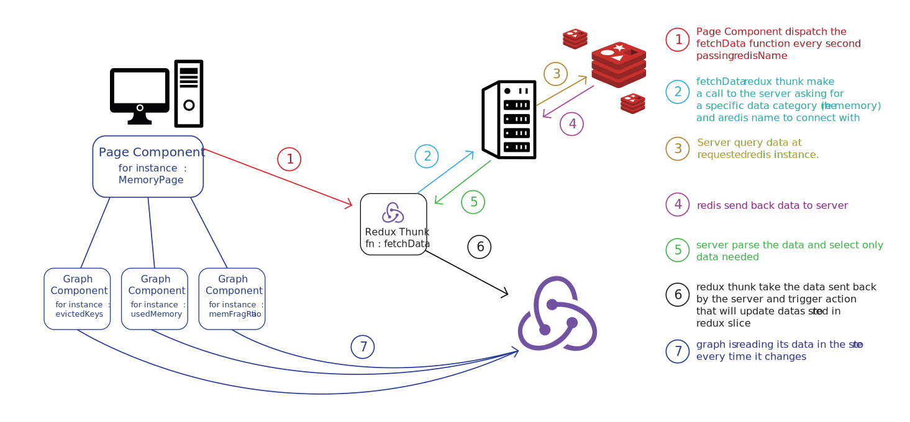

# RediSee - An Easy-To-Use Redis Visualizer for Developers

​
RediSee is a light-weight web application that visualize Redis instances’ core metrics in a user-friendly manner. Our open-source tool is available for free and allows developers to easily monitor essential metrics such as memory usage, keyspace cache/hit ratio, evicted keys, as well as latency and throughput data.
<br>
<br>
​

## How Install Redis on your computer

​
<br />
​
You'll will need a running Redis instance on your RAM in order to test RediSee
here the steps to follow on official Redis website :
​
<br />
​

```
     https://redis.io/docs/getting-started/
```

​
<br />
​
run a local Redis database by using the command redis-server on your terminal
​
<br />
​

```
    $ redis-server
```

​
<br />
​
this will start a redis instance with the default value of : port: 6379, host: 127.0.0.1
You are now ready to use RediSee on your newly running Redis instance.
​
<br />
<br />
​

## How to use Redisee ?

​
<br>

- Clone the repo to your local machine

```
 git clone https://github.com/RediseeLabs/redisee.git
```

<br/>

- Install all dependencies and run the webserver to run the app locally

```
npm install
npm run dev
```

​
- After the webpage has loaded, click on either the "+" or "connect" button and fill in the name of your Redis instance and fill port and host inputs (default value for local redis is port : 6379, host: 127.0.0.1). You will notice your Redis instance added on the sidebar as soon as the form has been submitted.

  [](https://gyazo.com/17b4fb62c987a268a9ace7d607eb3e73)


<br>
<br>

- Click on any of the metrics buttons(Performance, Memory, etc) to monitor the health of your Redis instance.

  [](https://gyazo.com/b875f76a7c916f44c97a0f8edcbc8998)


<br>
<br>

​
- You can create multiple instances and monitor them individually.

  [](https://gyazo.com/6d826d6ff44b865d1610c5237c89e0d2)
 
  
<br>
<br>

- If you no longer need to monitor them, you can clear them all at once or individually.

  [](https://gyazo.com/98c2dff48b2cb3d7a9fdc0fcbbecbbe1)
  

<br>
<br>

- Dark mode supported

  [](https://gyazo.com/0914a555f0d3a69b85efb6a4badc7435)
  
<br>

<br />

## RediSee v1.0 features

<br />

- Add, Delete, Clear redis Clients
- Display all Data fetched in easy to understand graphs
- Look at different category of data by using tabs
- Switch theme from dark to light
​
## Contributing
​
We welcome suggestions and pull requests!
Contact us on GitHub
​
<br />
​
### Feature we'd love to see implemented in the future :

<br />

- Abilities to records all metrics for a period of time and persist it in the database
- Interpret metrics recorded. For example, a user might want to check average latency between  March 18th  1pm and 6pm.
- Give the user the possibility to change the interval of data being recorded (now defaults to 1s)
- Refactor graphs and type of metrics fetched. Right now we're not using the most optimal graphs types for displaying data.
- Interact with Redis database by SET, PUT, DELETE keys through an interface.
- Being able to see data held by Redis database and Sort/filter it
- Redis can run in cluster mode which means Instances are connected together, get different roles (Master/Slave) and data is sharded. Opportunities for visualization
- Be able to clear datas
- Sometimes redis can be protected by a password, we'll need a optionnal field in the form to handle that
- Error page is under work, it need to be implemented
- Implement TypeScript

Testing:

- Testing setup is ready but we definitely need test coverage

Bugs found :

- Sometime the user is not redirected correctly
- Send different error status from the server to the client so Message modal can interpret response from server easily
​
## License
​
[MIT](https://choosealicense.com/licenses/mit/)
​
## Team
​
Garrett Yan //
garrettyan6@gmail.com
​
Anna Ivakhnik //
ai1337@nyu.edu
​
Patrice Pellan //
pellan.patrice@gmail.com
​
David Koo //
jonghyunkoo92@gmail.com



